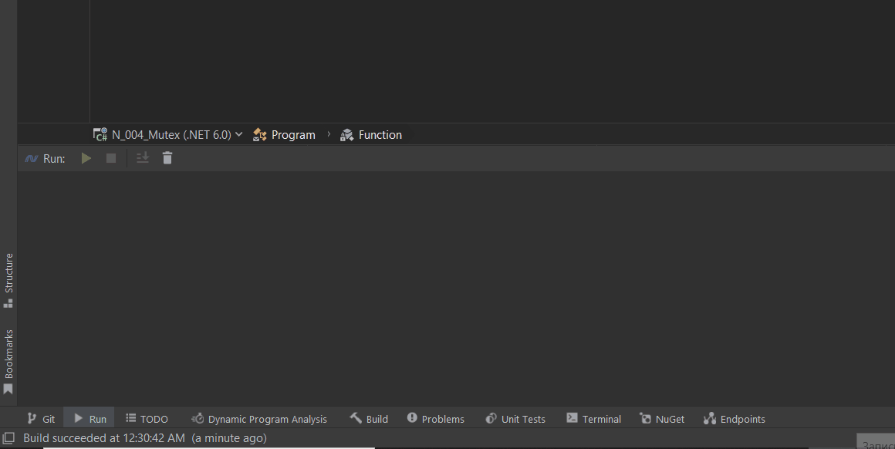
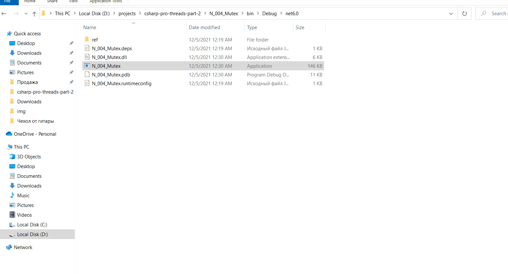
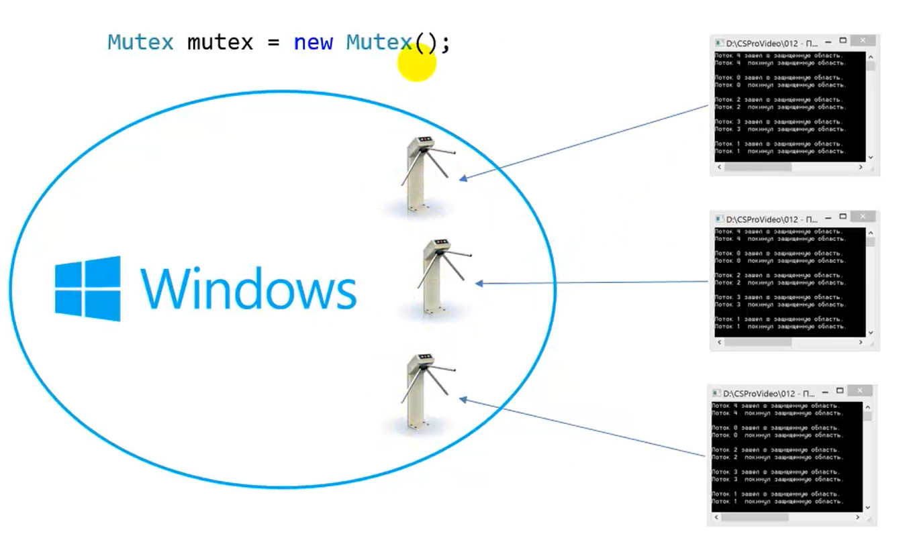
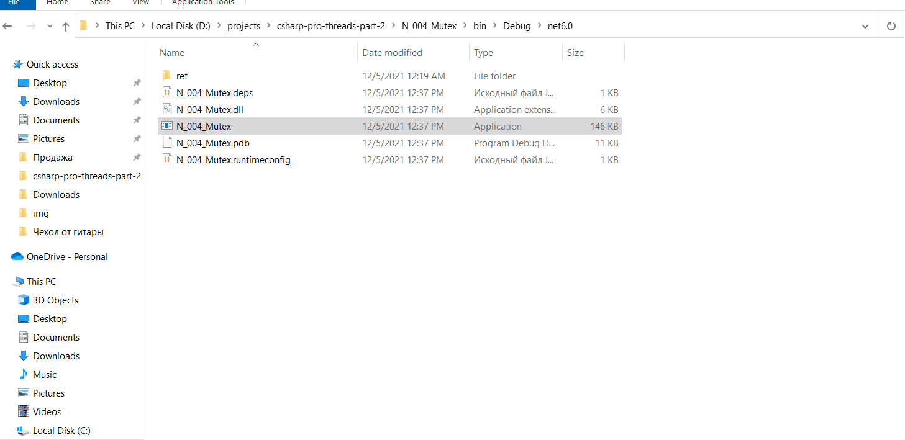

Простой пример 1 приложение

Пример работы нескольких приложений

Пример работы с задержкой перед стартом потока 
Потоки выполняются в нескольких приложениях

Если не указать имя, то у каждого приложения будет свой экземпляр мъютекса

Результат работы с мъютексом без имени

