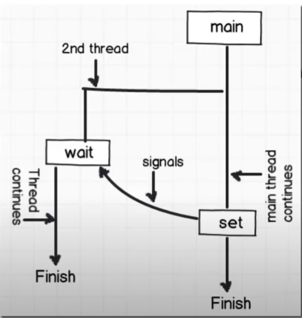

Принцып работы AutoResetEvent

Один поток сообщает другому сигнал, чтобы тот продолжил свою работу
после остановки. 

Вторичный процесс продолжает работу при нажатии клавиши 
Поток ждет после WaitOne пока не выполнится Set()

