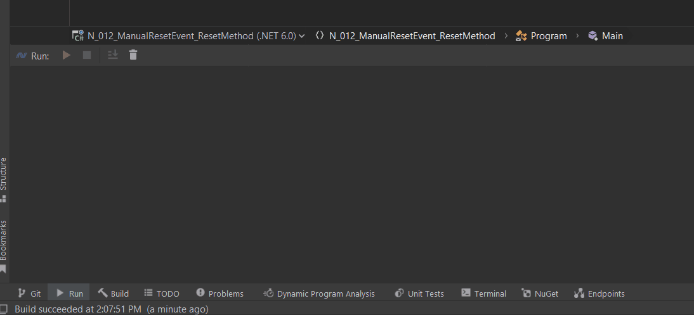
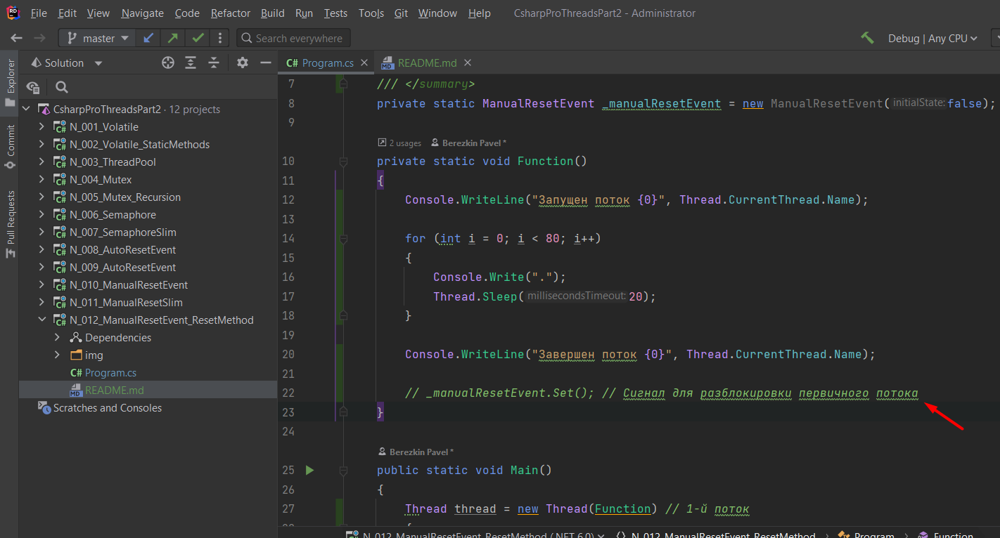
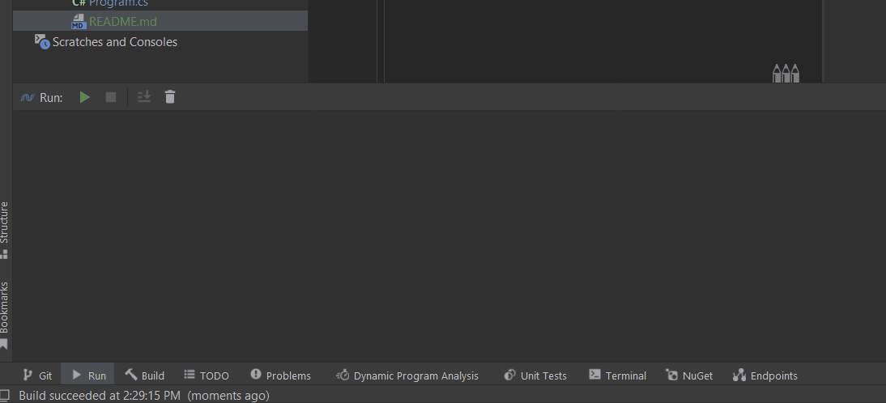
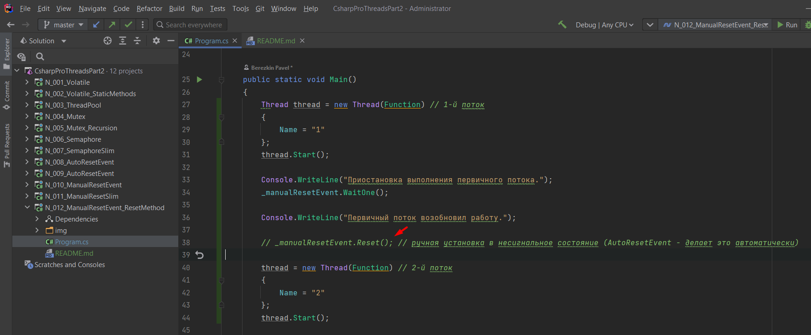
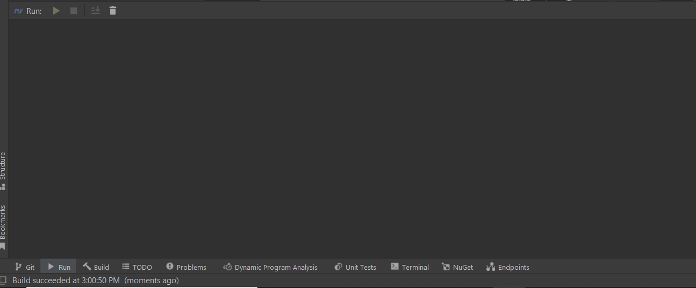



Пример отключения <b>manualResetEvent.Set()</b>

Результат работы.
Первичный поток не возобновляет работу.

Пример отключения <b>manualResetEvent.Reset()</b>

Первичный поток быстрее завершает свою работу.

